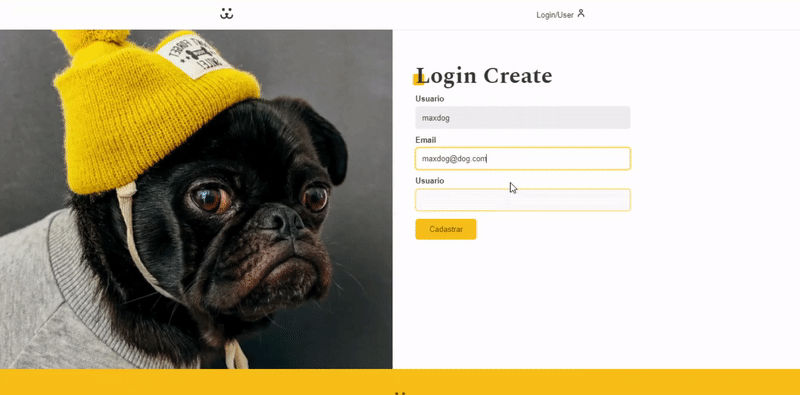
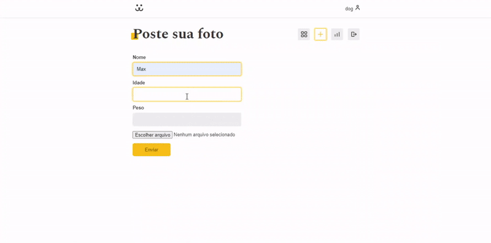

# Social network for dogs

<p>Social network made exclusively for your pet.</p>

<p>
  
  
  
</p>


## Tópicos 

[Sobre a aplicação](#sobre-o-foodfy)

[Funcionalidades](#funcionalidades)

[Tecnologias e Ferramentas](#tecnologias-e-ferramentas)

[Instalação e uso](#instalação-e-uso)


<br>

## Sobre o Foodfy

🐶 A Social network for dogs, é uma aplicação responsiva  desenvolvida na conclusão de um mega curso de React Js, na plataforma https://www.origamid.com/.  Foram utilizadas as principais funcionalidades da biblioteca, com o intuito de abordar os principais conceitos e boas práticas no desenvolvimento. 

<h3 align="left">🦴 Gifs mostrando um pouco da aplicação</h3>
<p align="center">
  
</p>

<br>

<h3 align="letf">🦴 Cadastro de usuários</h3>
<p align="center">
  
</p>

  🐶 No momento de cadastro de usuários o sitema faz verificações do tipo, nome de usuário válido, email válido /não cadastrado anteriomente e padrões de senha.

<br>

<h3 align="left">🦴 Reacupere senha</h3>
<p align="center">
  
</p>

🐶 Logo após o envio do email ou nome do usuário cadastrado, o usuário recebe um email contendo um link para a pagína de alteração de senha.

<br>

<h3 align="left">🦴 Poste novas fotos</h3>
<p align="center">
  
</p>

🐶 Logo após a postagem da foto o usuário é redirecionado, para a pagína do seu perfil.

<br>

## Funcionalidades

- [X] Cadastro de usuário
- [X] Sistema de login, recuperação e alteração de senha.
- [X] Comentários em publicações de outros usuários.
- [X] Acesso a estatísticas do seu perfil.
- [x] Gráficos criados utilizando a biblioteca com Victory.
- [X] Páginas dinâmicas com React js.

<br>

## Tecnologias e Ferramentas

As seguintes tecnologias foram utilizadas no desenvolvimento do projeto:

- [HTML](https://devdocs.io/html/)
- [CSS](https://devdocs.io/css/)
- [JavaScript](https://devdocs.io/javascript/)
- [React Js](https://devdocs.io/Reactjs/)
- [styled-components](https://devdocs.io/styled-components/)
- [Victory](https://devdocs.io/Victory/)

<br>

## Instalação e Uso

Para rodar a aplicação, você precisa instalar o [Node](https://nodejs.org/en/)

Siga os passos abaixo:

```bash
# Abra um terminal e copie este repositório com o comando
$ git clone https://github.com/vitorSantanaDev/socialNetworkForDogs.git
# ou use a opção de download.

# Entre na pasta com 
$ cd socialNetworkForDogs

# Instale as dependências
$ yarn install

# Rode a aplicação
$ yarn start
```

<br>

---

Feito com :yellow_heart: by [Vitor_Santana](https://github.com/vitorSantanaDev)

[](https://www.linkedin.com/in/vitor-santana-bbb607217/) 
[](mailto:vitorsantana.developer@gmail)
